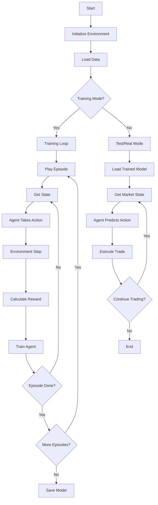
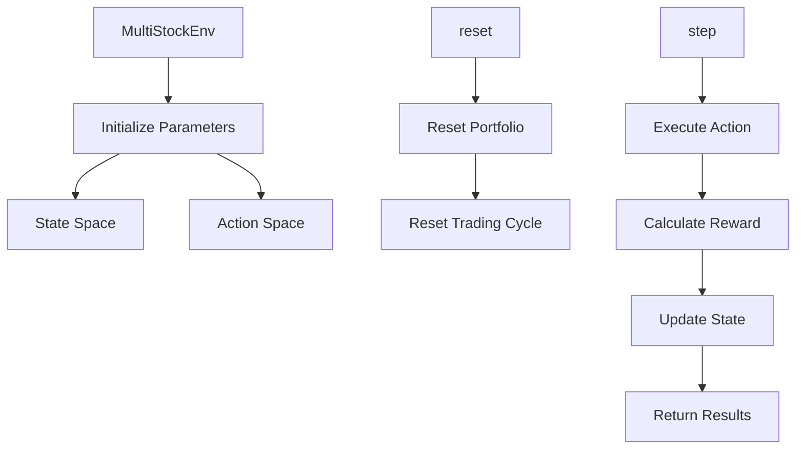
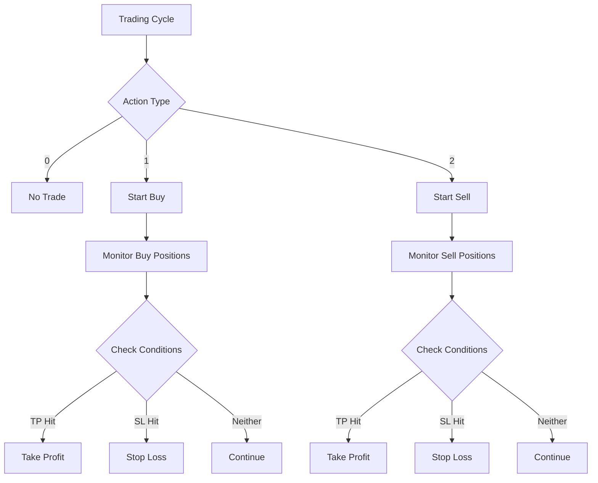
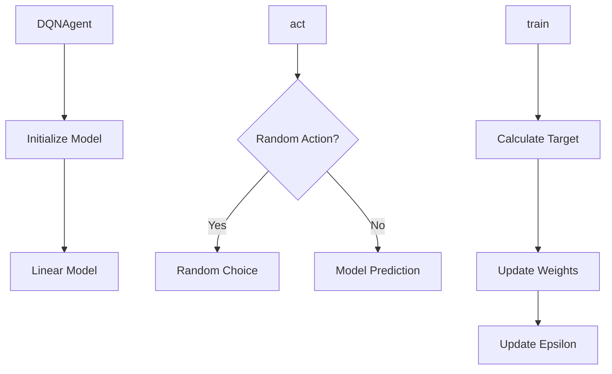

Here's the high-level Mermaid flowchart:

Here are the main components:

1. Environment (`MultiStockEnv` class):

1. Trading Logic:

1. Agent Logic (`DQNAgent` class):

Key components explanation:

1. **Data Processing**:
- Uses historical price data with OHLC and moving averages
- Scales data using StandardScaler
- Splits data into training and testing sets
1. **Environment**:
- Manages trading state and actions
- Handles position entry/exit
- Calculates rewards based on profit/loss
- Implements grid trading strategy with multiple levels
1. **Agent**:
- Uses linear model for Q-learning
- Implements epsilon-greedy exploration
- Handles model training and prediction
1. **Trading Strategy**:
- Uses 3-level grid trading system
- Implements take profit and stop loss
- Manages position sizing and risk
1. **Modes of Operation**:
- Training: Learns from historical data
- Testing: Evaluates strategy on unseen data
- Real: Live trading with database integration